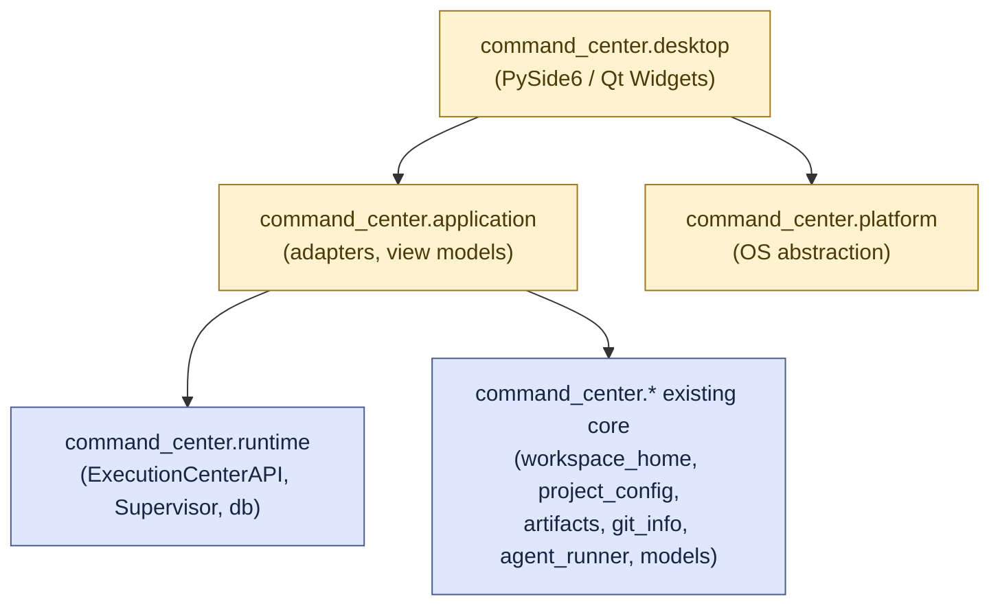
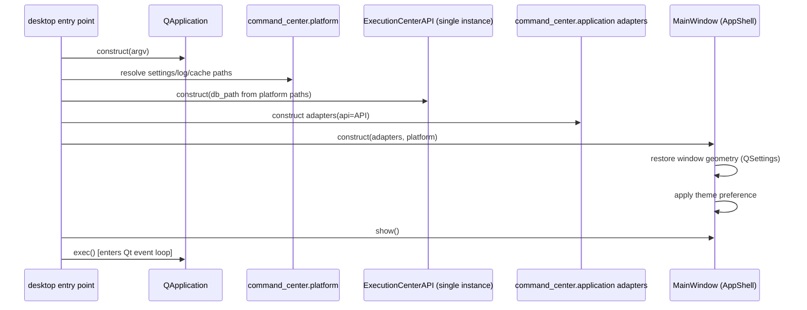
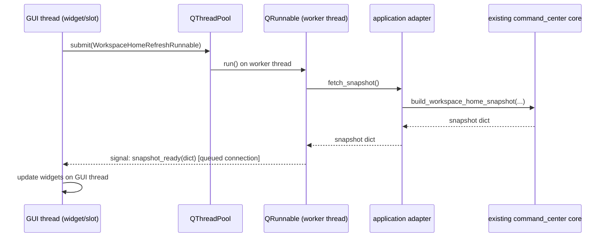
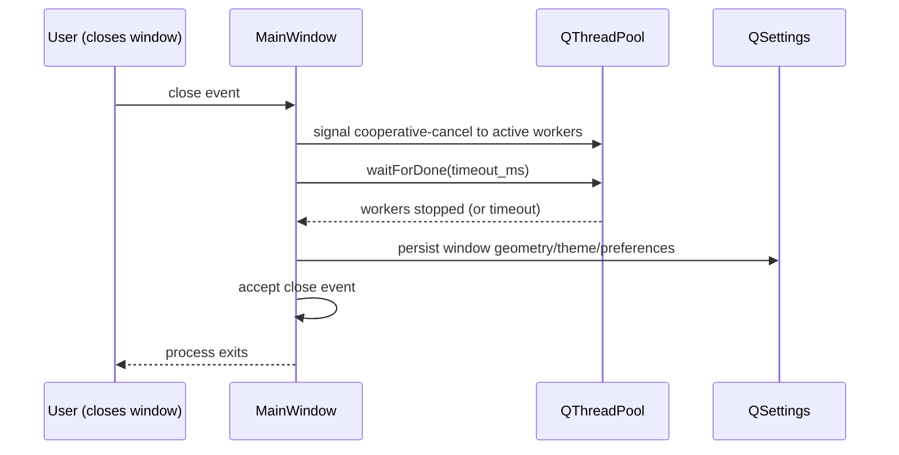

# AI Command Center — Desktop Architecture

Status: **D1 shipped; D2–D3 are target architecture.** `command_center.desktop` exists today as
the Increment 1 native shell. The `command_center.application` and `command_center.platform`
packages named below remain **target structure for later increments** (D2–D3, see
`DESKTOP_INCREMENT_1.md`) and do not exist in the repository yet. Where this document says
"existing," it refers to code already present under `command_center/` and `command_center/runtime/`
today, verified by reading that code directly, not aspirational.

This document defines the architecture the desktop application must be built to. It does not
implement it — see `IMPLEMENTATION_ROADMAP.md` for the increment sequence that will.

## 1. Target package architecture

```
command_center.desktop          (NEW — D1)
    → command_center.application    (NEW — D2, thin adapters)
        → command_center.runtime        (EXISTING — ExecutionCenterAPI, Supervisor, db)
        → command_center.*               (EXISTING — project_config, workspace_home,
                                            artifacts, git_info, agent_runner, models, ...)
    → command_center.platform       (NEW — D3, OS abstraction)
```

- **`command_center.desktop`** — PySide6/Qt Widgets presentation layer: `QApplication`,
  main window, sidebar, top bar, pages, dialogs, view models, Qt signal/slot wiring. Owns no
  business logic and performs no filesystem or subprocess I/O of its own.
- **`command_center.application`** — thin adapters between the presentation layer and the
  existing runtime/read-model core. Translates existing plain-Python return values (dicts, as
  produced by `command_center.workspace_home.build_workspace_home_snapshot` and
  `ExecutionCenterAPI`) into whatever shape a Qt view model needs, and translates a Qt-issued
  request (e.g. "refresh Workspace Home") into a call against the existing core. Owns the one
  application-wide `ExecutionCenterAPI` instance.
- **`command_center.runtime` and existing read models** — unchanged. `command_center.runtime`
  (`db.py`, `supervisor.py`, `api.py`, `context_service.py`, ...), `command_center.workspace_home`,
  `command_center.project_config`, `command_center.artifacts`, `command_center.git_info`,
  `command_center.agent_runner`, `command_center.models`, `command_center.report_parser`, and
  every other existing `command_center/*` module are **reused, not rewritten** (binding decision
  9). The desktop application is a new consumer of this code, not a replacement for it.
- **`command_center.platform`** — OS abstraction: reveal-in-file-manager, platform name,
  system-theme signal, standard application-data directories (settings/log/cache/crash paths).
  See `PLATFORM_BEHAVIOR.md` for the full contract. No other package may contain
  platform-specific branching (`sys.platform`, `platform.system()`, OS-specific paths) — see §6.

`command_center.desktop` depends on both `command_center.application` and
`command_center.platform`; `command_center.application` depends on the existing runtime and
core modules; `command_center.platform` depends on nothing else in this list. There is no
dependency in the reverse direction anywhere in this graph.

### 1.1 Package/layer dependency diagram



Blue nodes exist today. Yellow nodes are target D1–D3 structure defined by this document.

## 2. PySide6 and Qt Widgets

PySide6 with **Qt Widgets** (not QML/Qt Quick) is the selected desktop framework (binding
decision 7). Qt Widgets was chosen because the application is form- and list-heavy (project
cards, run tables, settings forms) rather than animation- or touch-heavy, and because Qt Widgets
gives direct, well-documented parity with native platform look-and-feel on both target platforms
without adopting a second UI declarative language (QML) alongside Python.

## 3. Application lifecycle

- **One `QApplication`** per process, constructed once in `command_center.desktop`'s entry
  point, before any window is created. There is no code path that constructs a second
  `QApplication` in the same process.
- **One application-owned `ExecutionCenterAPI`.** `command_center.application` constructs
  exactly one `ExecutionCenterAPI` instance at startup (mirroring the existing Streamlit
  application's `@st.cache_resource`-backed singleton in spirit, but as an explicit
  application-lifetime object rather than a Streamlit-managed cache entry) and passes it to
  every adapter that needs it. No adapter, view model, or page constructs its own
  `ExecutionCenterAPI` or a second `Supervisor`.
- Startup order: construct `QApplication` → construct `command_center.platform` services
  (settings store, standard paths) → construct the one `ExecutionCenterAPI` → construct
  `command_center.application` adapters → construct the main window → show the main window →
  enter the Qt event loop (`QApplication.exec()`).

### 3.1 Application startup diagram



## 4. Presentation layer

`command_center.desktop` contains: the main window (`AppShell`), navigation (`Sidebar`,
`NavigationItem`), `TopBar`, per-page widgets (`Home`, `Projects`, `Settings`, and disabled
placeholders for future sections — see `INFORMATION_ARCHITECTURE.md`), and shared components
defined in `DESIGN_SYSTEM.md`. Every widget reads data only from a view model supplied by
`command_center.application`; no widget reaches into `command_center.runtime` or
`command_center/*` directly.

## 5. Application-service adapters

`command_center.application` exposes one adapter per page/concern (e.g. a Workspace Home
adapter wrapping `build_workspace_home_snapshot`, a Projects adapter wrapping
`project_config.load_project_configs`/`save_repository_path`/`validate_repository_path`, a
Settings adapter wrapping platform preference storage). Each adapter:

- takes the shared `ExecutionCenterAPI` instance and any other shared existing-core objects as
  constructor arguments (never constructs its own);
- exposes plain-Python methods returning plain dicts/dataclasses — no Qt types in its public
  surface, so it remains testable without a running `QApplication`;
- performs no Qt widget construction or signal emission itself; it is called *from* a
  background-thread worker (§8) or the GUI thread, and its return value is handed to a Qt signal
  by the caller, not by the adapter.

## 6. Platform abstraction

`command_center.platform` is the **only** package permitted to contain OS-specific branching.
Its contract (detailed in `PLATFORM_BEHAVIOR.md`) includes: `reveal_in_file_manager(path)`,
`platform_name()`, system-theme change notification, and standard application-data location
resolution (settings/log/cache/crash directories). No `command_center.runtime`,
`command_center.application`, or existing `command_center/*` domain module may branch on
`sys.platform`/`platform.system()` or hardcode an OS-specific path — that logic belongs
exclusively in `command_center.platform`.

## 7. Reusable existing core

Binding decision 9 is structural, not aspirational: `command_center.application` adapters call
existing functions verbatim — `build_workspace_home_snapshot`, `ExecutionCenterAPI.list_runs`/
`list_sessions`/`list_tasks`/`get_run`/`get_events`/`get_report`, `project_config.*`,
`git_info.*`, `artifacts.*` — with no forked copies and no parallel reimplementation. Any gap
between what an existing read model returns and what a desktop view needs is closed by adding a
narrow, additive method to the existing module (following the same pattern as
`WORKSPACE_HOME_ARCHITECTURE.md`'s `states`/`limit` extension to `list_runs`), not by
duplicating its logic inside `command_center.application`.

## 8. Dependency rules

```
command_center.desktop      → command_center.application, command_center.platform
command_center.application  → command_center.runtime, command_center.* (existing core)
command_center.platform     → (nothing in this graph; stdlib + Qt only)
command_center.runtime      → (unchanged; no new dependents beyond command_center.application)
command_center.* (existing) → (unchanged)
```

Every arrow points one direction. Nothing existing (`command_center.runtime`,
`command_center.workspace_home`, `command_center.project_config`, etc.) may import from
`command_center.desktop`, `command_center.application`, or `command_center.platform`.

### 8.1 Forbidden dependencies

Explicitly prohibited, in all cases, starting with the first line of code in Desktop Increment
1:

- `command_center.desktop` importing anything from `app.py` (the Streamlit entry point).
- `command_center.runtime` or any existing `command_center/*` module importing `PySide6` or any
  Qt symbol.
- `app.py`/Streamlit being imported or started anywhere on the desktop application's startup
  path.
- Any local HTTP listener (Flask/FastAPI/`http.server`/a Streamlit server) started by the
  desktop application.
- A browser process started by the desktop application as part of normal operation.
- OS-specific branching (`sys.platform`, `platform.system()`, hardcoded platform paths) outside
  `command_center.platform`.

These rules are enforced by code review at every increment gate (`DESKTOP_INCREMENT_1.md`,
`IMPLEMENTATION_ROADMAP.md`), not only documented here.

## 9. GUI thread boundaries

Qt Widgets requires all widget construction, mutation, and painting to happen on the **GUI
thread** (the thread that called `QApplication.exec()`). No adapter method that performs
filesystem I/O, subprocess calls, or SQLite access (i.e. anything in `command_center.runtime` or
existing `command_center/*`) is ever called directly from a Qt slot connected to run
synchronously on the GUI thread for an operation that is not near-instantaneous — see §10.
Widget updates resulting from background work happen only inside a slot invoked (by Qt's
signal/slot mechanism) back on the GUI thread; a worker thread never touches a `QWidget`
directly.

## 10. QThreadPool / QRunnable / signals model

Long-running or I/O-bound calls into `command_center.application` adapters (a Workspace Home
refresh, a repository-path validation, a worktree scan) run on Qt's `QThreadPool` via a
`QRunnable` (or `QObject`-based worker moved to a `QThread`, for cases needing its own signal
object) — never on the GUI thread. Pattern:

1. A GUI-thread slot (e.g. "Refresh" button clicked) submits a `QRunnable` to
   `QThreadPool.globalInstance()`.
2. The `QRunnable.run()` method (executing on a worker thread) calls the relevant
   `command_center.application` adapter method synchronously — this is safe because the adapter
   itself is plain Python with no Qt dependency (§5).
3. The `QRunnable` emits a Qt signal (via a small `QObject` signal-holder, since `QRunnable`
   itself is not a `QObject`) carrying the result or an error.
4. The GUI thread's connected slot receives the signal (Qt's queued connection delivers it on the
   receiver's thread — the GUI thread) and updates widgets.

No adapter or existing `command_center/*` function is ever called directly from a
`Qt.DirectConnection` slot invoked from a non-GUI thread without going through this pattern.

### 10.1 Asynchronous refresh flow diagram



## 11. Cooperative cancellation

A worker (`QRunnable`) checks a shared, thread-safe cancellation flag (e.g. a
`threading.Event`, set by the GUI thread when a newer refresh supersedes an in-flight one, or on
shutdown) at safe checkpoints between adapter calls. Cancellation is **cooperative**: the desktop
application never forcibly kills a worker thread. This mirrors the existing
`Supervisor`'s own cooperative-cancellation model for subprocesses (`request_cancel`, SIGTERM to
process group, SIGKILL only after a grace period) — the desktop layer adds no new forceful
termination primitive.

## 12. Error propagation

An adapter call that raises propagates the exception back through the `QRunnable` to a signal
carrying the error (never re-raised on a worker thread and silently dropped). The GUI thread's
connected slot is responsible for surfacing it — typically via the `ErrorState`/`Toast`
components defined in `DESIGN_SYSTEM.md`. No exception from `command_center.application` or
existing core code is ever swallowed silently by the presentation layer.

## 13. Bounded clean shutdown

On window close: the desktop application signals any in-flight `QThreadPool` workers to stop
cooperatively (§11), waits up to a bounded timeout for `QThreadPool.waitForDone(timeout_ms)`, and
only then allows `QApplication.exec()` to return. Desktop Increment 1 performs no agent-run
lifecycle management (starting/cancelling runs is out of scope, see `DESKTOP_INCREMENT_1.md`),
so shutdown in D1 has no subprocess to reconcile — this section documents the bound the shell
itself must respect for its own worker threads, and is the seam later increments (which do add
run control) will extend rather than redesign.

### 13.1 Shutdown flow diagram



## 14. State ownership

- **Window geometry, theme, density, and workspace preferences** are owned by
  `command_center.desktop` and persisted via `command_center.platform`'s settings abstraction
  (backed by `QSettings`, see `PLATFORM_BEHAVIOR.md`).
- **Repository-path configuration** is owned by the existing `command_center.project_config`
  module (`data/project_config.json`) — the desktop application reads and writes it exclusively
  through that module's existing functions (`load_project_configs`, `save_repository_path`,
  `validate_repository_path`), never by touching the JSON file directly.
- **Run/session/report/task state** is owned entirely by `command_center.runtime` (SQLite) and
  the existing v1.2 JSON/JSONL stores — the desktop application never introduces a second store
  for this data.

## 15. Persistence boundaries

The desktop application introduces exactly one new persistence surface:
platform-native application settings (window geometry, theme, density, last-selected project) —
see `PLATFORM_BEHAVIOR.md` §"Platform abstraction contract". It introduces no new data file, no
new SQLite table, and no new JSON/JSONL store. Every other persisted fact continues to live where
it lives today.

## 16. Packaging boundary

`command_center.desktop`'s entry point (`python -m command_center.desktop`, via
`command_center/desktop/__main__.py`) is the single executable/packaging target. **PyInstaller is
the selected packaging tool** for both platforms (see `PLATFORM_BEHAVIOR.md` and
`DESKTOP_INCREMENT_1.md` D4) — chosen because it is the most widely used, best-documented
packaging tool for PySide6 applications on both macOS and Windows, avoiding a second, less-proven
toolchain per platform. Packaging concerns (bundling the Python interpreter, resolving
`PySide6`'s native Qt libraries, code-signing hooks) are confined to build scripts and
`command_center.platform`'s standard-path resolution; they never leak into
`command_center.application` or existing core modules, which remain runnable and testable
under a plain `python`/`pytest` invocation with no packaging step.

## 17. Testing seams

- `command_center.application` adapters are unit-testable with plain `pytest`, exactly like
  existing `command_center/*` modules — no `QApplication` instance required, because adapters
  contain no Qt import (§5).
- `command_center.platform` functions are unit-testable per-platform-behavior with `pytest`,
  using `pytest`'s monkeypatching to simulate the non-host platform where behavior must be
  verified without a second OS.
- `command_center.desktop` widget-level tests use **`pytest-qt`** (the selected Qt test tooling —
  see `IMPLEMENTATION_ROADMAP.md` D1A) against an offscreen `QApplication`
  (`QT_QPA_PLATFORM=offscreen`), mirroring how `streamlit.testing.v1.AppTest` exercises `app.py`
  today without a real browser.
- No test — at any layer — ever invokes the real `claude` CLI or a real subprocess agent run,
  matching the existing test suite's convention (`tests/conftest.py`'s `fake_claude` fixture and
  friends, reused unchanged).
